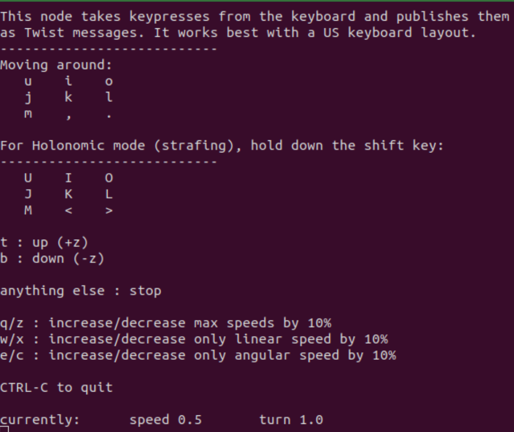
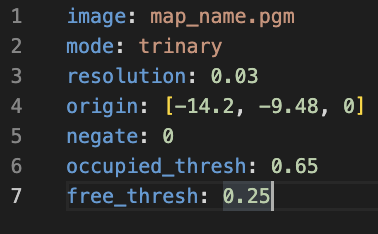
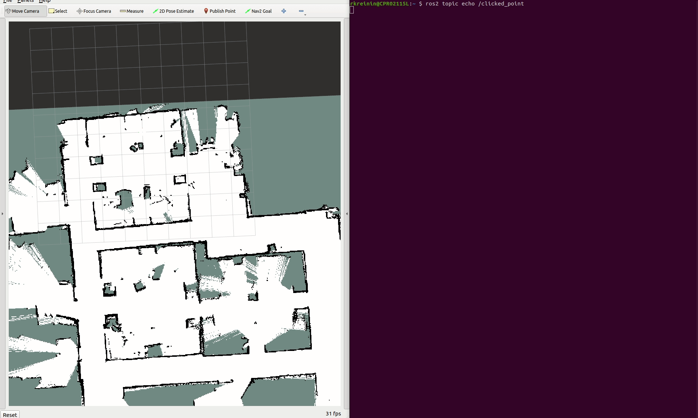

# SOCIAL_NAVIGATION 🤖

INFO 5356-030: Introduction to Human-Robot Interaction 

Lab 5 - Social Navigation

In this lab, you will learn how to build a map of the environment, send navigation waypoints to the robot. You will use localization and mapping to enable the robot to locate objects in the environment as it navigates. The Turtlebot 4 platform comes equipped with the ROS2 Navigation Stack which is software that enables robots to autonomously navigate in an environment (see [Tutorial](https://turtlebot.github.io/turtlebot4-user-manual/tutorials/generate_map.html) reference).  

The learning outcomes of Lab 5 are:
- [Task 1 - Create a map](#Task-1---Create-a-map) 
- [Task 2 - Send navigation waypoints to the robot](#Task-2---Send-navigation-waypoints-to-the-robot) 
- [Task 3 - Create a Social Navigation Node](#Task-3---Create-a-Social-Navigation-Node) 
- [Task 4 - Test Social Navigation Node on the Turtlebot](#Task-4---Test-Social-Navigation-Node-on-the-Turtlebot) 

## Task 1 - Create a map

This task involves generating a map of the robot’s environment so that it can avoid colliding into obstacles as it navigates an environment using Simultaneous Localization and Mapping (SLAM). SLAM scans the environment using the Lidar sensor to create a 2D occupancy grid that records the locations of objects.

### Step 0 (Optional if lidar not on): (Run on Pi) Launch Lidar

SSH into the Raspberry Pi and launch RPLIDAR nodes. Open a new terminal and run:
```
ssh ubuntu@TURTLEBOT#_IP_ADDRESS
ros2 launch turtlebot4_bringup oakd.launch.py 
```
### Step 1: (Run on Pi) Launch SLAM on Raspberry Pi

SLAM relies on RPLIDAR nodes to map an environment as a 2D occupancy grid. Launch the RPLIDAR and description nodes and run SLAM on the robot. Open a new terminal and run:
```
ssh ubuntu@TURTLEBOT#_IP_ADDRESS
ros2 launch turtlebot4_navigation slam_sync.launch.py
```
### Step 2: (Run locally) Launch RVIZ

Visualize the 2D map in RVIZ using the view_robot launch file. Open a terminal and run:
```
ros2 launch turtlebot4_viz view_robot.launch.py
```

### Step 3: (Run locally) Scan Tata 251 room

Drive the robot to scan the room using RPLIDAR. Drive the robot around the Tata 251 to scan it with the Lidar sensor to generate a 2D occupancy grid. The robot can be operated using teleop or driving the robot with the remote controller. Open a terminal and run:

### Teleop:
```
ros2 run teleop_twist_keyboard teleop_twist_keyboard
```
<p align="center"> 
</img> 
</p>

### Remote Controller:
```
ros2 launch turtlebot4_bringup joy_teleop.launch.py
```

### Step 4: (Run locally) Save the map

After building the map, save it to your ROS workspace. Open a terminal, navigate to your ROS workspace, and save the map (replace 'map_name' with your desired filename e.g., ‘tata_251_group#’). Lastly, confirm that the map has been saved in the last step below by confirming your map is in the current directory. Open a terminal and run:
```
cd ~<ros_workspace>/
ros2 service call /slam_toolbox/save_map slam_toolbox/srv/SaveMap "name: data: 'map_name'"
ls
```

### Step 5: (View locally) View the map

Saving the map generates 'map_name.pgm’ and 'map_name.yaml' files. Open the .pgm file to confirm that your map looks correct.

Checkpoint 1: Provide the .pgm and .yaml files generated from your robot. 

<p align="center"> 
</img> 
</img> 
</p>
Figure: Example Tata 251 ‘.pgm’ (left) and ‘.yml’ (right) files for the map.

## Task 2 - Send navigation waypoints to the robot

The goal of this task is to design a delivery robot that navigates from the following positions:
- Docking station
- Waypoint 1
- Waypoint 2
- Docking station

### Step 1: (Run locally) Load the new map into ROS2 Navigation Stack

Open a terminal and run this command using your .yaml file from Task 1. Open a new terminal and run:
```
ros2 launch turtlebot4_navigation nav_bringup.launch.py slam:=off localization:=true map:=tata_251.yaml
```

### Step 2: (Run locally) Launch RViz

Launch RViz to collect (x, y) waypoints for the robot to navigate through. Open a terminal and run:
```
ros2 launch turtlebot4_viz view_robot.launch.py
```
### Step 3: (Run locally) Collect waypoints

Collect 2D waypoints for your robot to navigate through using the 2D Pose Estimate tool.

Open a terminal and echo the /clicked_point topic:
```
ros2 topic echo /clicked_point
```
Click on the ‘Publish Point’ button and then click on the desired waypoint on the map and record the x and y coordinates for 2 waypoints (used in next step).

<p align="center"> 
</img>

Figure: this shows an example of collecting (x,y) locations from RViz using the ‘Publish Point’ button and clicking on the point as it echoes the point information in a separate terminal.

No Checkpoint.

## Task 3 - Create a Social Navigation Node

The goal of this task is to set up a ROS2 workspace with the social_navigation package.

### Step 1: (Run locally) Clone the Social Navigation node 

Clone the code from Github into the ~/<ros_workspace>/src directory and move the bash scripts to the ~/<ros_workspace>/ directory. Open a terminal and run:
```
cd ~/<ros_workspace>/src
git clone https://github.com/Cornell-Tech-Intro-HRI/social_navigation
mv social_navigation_pkg/run_social_navigation.sh  ~/<ros_workspace>/
```

### Step 2: Customize package.xml Update the following fields:

Maintainer - Enter group member names
Maintainer Email - Email one email address from the student group members
Description - Add a brief description of the proxemic detector package

### Step 3: Set waypoints

Enter the two (x,y) waypoints you recorded in Task 1 on lines 25 and 26 of social_navigation_node.py file.

### Step 4: Run the social_navigation node. Open a terminal and run:
```
bash ~/<ros_workspace>/run_social_navigation.sh
```
Checkpoint 2: Zip and submit your final social_navigation_pkg folder.

## Task 4 - Test Social Navigation Node on the Turtlebot 

The social navigation node is expected to enter the docking station, approach two waypoints, and navigate back to the docking station.

Checkpoint 3: Your task is to test your node to ensure it achieves the desired behavior and record a video of the robot. 

## Further Issues and questions ❓ 

If you have issues or questions, don't hesitate to contact [Angelique Taylor](https://www.angeliquemtaylor.com/) at amt298@cornell.edu or [Tauhid Tanjim](https://tanjim13.github.io/tauhidtanjim/) at tt485@cornell.edu.